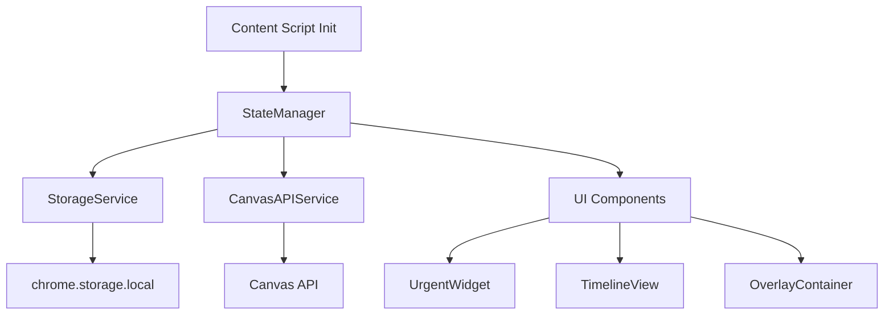
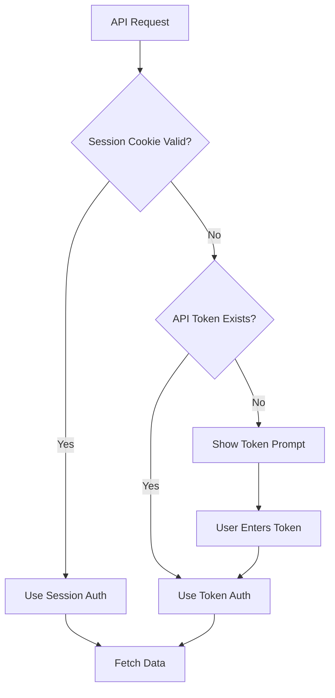

## Technical Architecture

### State Management Flow


### Authentication Flow



### Data Filtering Logic

**Most Urgent (48-hour filter):**
```javascript
const urgentItems = plannableItems.filter(item => {
  const dueDate = new Date(item.plannable.due_at);
  const hoursUntilDue = (dueDate - now) / (1000 * 60 * 60);
  return hoursUntilDue >= 0 && hoursUntilDue <= 48;
});
```

**Timeline Spacing:**
- Calculate date range (earliest to latest due date)
- Distribute assignments proportionally along horizontal axis
- Use CSS `transform: translateX()` for positioning
- Min spacing: 120px between cards to prevent overlap

---

## Verification Plan

### Automated Tests
```bash
# Load unpacked extension in Chrome
# Navigate to Canvas dashboard
# Verify overlay appears
# Test authentication flow
# Verify data fetching
```

### Manual Verification
1. **Authentication Testing**:
   - Test session-based auth on active Canvas session
   - Test token fallback by clearing cookies
   - Verify error messages for invalid tokens

2. **UI Integration Testing**:
   - Verify overlay appears on Canvas dashboard
   - Test toggle show/hide functionality
   - Verify no CSS conflicts with Canvas UI
   - Test responsive behavior on different screen sizes

3. **Feature Testing**:
   - Verify "Most Urgent" widget shows only 48-hour items
   - Verify traffic light colors match urgency levels
   - Verify timeline scrolls smoothly
   - Verify assignment cards positioned correctly by date

4. **Performance Testing**:
   - Measure initial load time
   - Verify caching reduces API calls
   - Test with large datasets (100+ assignments)

5. **Cross-browser Testing**:
   - Test on Chrome (primary)
   - Test on Edge (Chromium-based)
   - Verify manifest v3 compatibility
