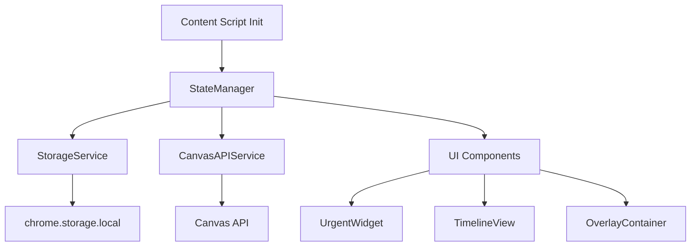
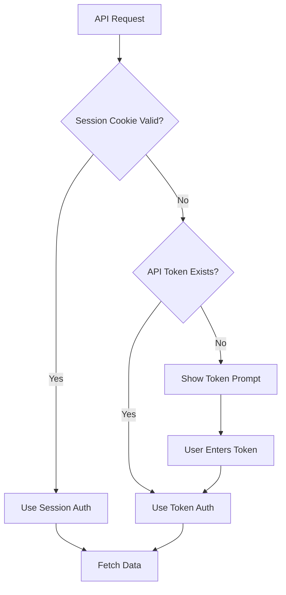

# Canvas Plus - Implementation Plan

Transform the existing Canvas Helper extension into a feature-rich "Canvas Plus" extension with Material Design 3 aesthetics, intelligent priority filtering, and an interactive timeline visualization.

## User Review Required

> [!IMPORTANT]
> **Authentication Strategy**: We'll implement a **hybrid authentication system** that attempts session-based auth first (using existing cookies), then falls back to manual API token entry if needed. This requires adding a settings panel for token management.

> [!IMPORTANT]
> **UI Injection Method**: The new features will be injected as a **floating dashboard overlay** that can be toggled on/off. This overlay will use **Shadow DOM** to prevent CSS conflicts with Canvas's Instructure styling.

> [!NOTE]
> **Popup Preserved**: The existing popup UI will remain unchanged and continue to function as-is. A separate settings page will be added for API token configuration and preferences.

## Proposed Changes

### Component 1: Core Architecture Refactoring

#### [MODIFY] [content.js](file:///c:/Users/Bhargav/OneDrive/Documents/canvas-helper/scripts/content.js)
- **Refactor into modular structure**: Split monolithic file into separate concerns
- **Extract API service**: Move all fetch logic to `CanvasAPIService` class
- **Extract storage service**: Move chrome.storage logic to `StorageService` class
- **Add state manager**: Create `StateManager` for centralized data management
- **Keep initialization logic**: Main entry point remains in content.js

#### [NEW] [services/CanvasAPIService.js](file:///c:/Users/Bhargav/OneDrive/Documents/canvas-helper/scripts/services/CanvasAPIService.js)
- Centralized API interaction layer
- Methods: `fetchCourses()`, `fetchPlannableItems()`, `fetchWithAuth()`
- Hybrid authentication: Try session cookies first, fallback to API token
- Error handling and retry logic
- Rate limiting protection

#### [NEW] [services/StorageService.js](file:///c:/Users/Bhargav/OneDrive/Documents/canvas-helper/scripts/services/StorageService.js)
- Abstraction layer for chrome.storage
- Methods: `getCourses()`, `getPlannableItems()`, `getApiToken()`, `setApiToken()`
- Hash-based cache validation (keep existing logic)
- Automatic cache expiration (add TTL support)

#### [NEW] [services/StateManager.js](file:///c:/Users/Bhargav/OneDrive/Documents/canvas-helper/scripts/services/StateManager.js)
- Centralized state management using observer pattern
- Properties: `courses`, `plannableItems`, `urgentAssignments`, `timelineData`
- Methods: `subscribe()`, `notify()`, `updateState()`
- Computed properties for filtered data (48-hour urgent items)

---

### Component 2: UI Components (Material Design 3)

#### [NEW] [components/OverlayContainer.js](file:///c:/Users/Bhargav/OneDrive/Documents/canvas-helper/scripts/components/OverlayContainer.js)
- Main overlay container with Shadow DOM
- Floating widget positioned on Canvas dashboard
- Toggle button for show/hide
- Draggable positioning (optional enhancement)
- Material Design 3 elevation and motion

#### [NEW] [components/UrgentWidget.js](file:///c:/Users/Bhargav/OneDrive/Documents/canvas-helper/scripts/components/UrgentWidget.js)
- "Most Urgent" card-based layout
- Filters assignments due within 48 hours
- Traffic light color coding:
  - **Red**: Due today or overdue
  - **Yellow**: Due tomorrow
  - **Green**: Due within 48 hours
- Card design with Material Design 3 styling
- Click to expand for details

#### [NEW] [components/TimelineView.js](file:///c:/Users/Bhargav/OneDrive/Documents/canvas-helper/scripts/components/TimelineView.js)
- Horizontal scrollable timeline
- Date markers from "Soonest" to "Furthest"
- Assignment cards positioned by due date
- Color-coded by priority (traffic light system)
- Smooth scrolling with momentum
- Responsive spacing using CSS Grid/Flexbox

#### [NEW] [styles/material-design.css](file:///c:/Users/Bhargav/OneDrive/Documents/canvas-helper/styles/material-design.css)
- Material Design 3 design tokens
- CSS custom properties for theming
- Elevation system (shadows)
- Motion/animation utilities
- Typography scale
- Color palette (primary, secondary, error, warning, success)
- **Scoped to Shadow DOM** to prevent Canvas conflicts

---

### Component 3: Settings & Configuration

#### [NEW] [settings/settings.html](file:///c:/Users/Bhargav/OneDrive/Documents/canvas-helper/settings/settings.html)
- Dedicated settings page for configuration
- API token input field with visibility toggle
- Authentication status indicator
- Overlay toggle preferences
- Timeline range selector (7/14/30 days)
- Material Design 3 styling
- Accessible via extension icon right-click → Options

#### [NEW] [settings/settings.js](file:///c:/Users/Bhargav/OneDrive/Documents/canvas-helper/settings/settings.js)
- Token management logic
- Settings save/load functionality
- "Test Connection" button with live validation
- Manual data refresh trigger
- Import/export settings feature

---

### Component 4: Manifest & Permissions

#### [MODIFY] [manifest.json](file:///c:/Users/Bhargav/OneDrive/Documents/canvas-helper/manifest.json)
- Update name to "Canvas Plus"
- Add `options_page` pointing to settings/settings.html
- Add host permissions for Canvas API domains
- Update content_scripts to match Canvas domains only
- Add web_accessible_resources for CSS/assets
- Update description

---

## Technical Architecture

### State Management Flow


### Authentication Flow


### CSS Isolation Strategy
- **Shadow DOM**: All overlay components rendered inside Shadow DOM
- **Scoped styles**: Material Design CSS only applies within shadow root
- **No global pollution**: Zero impact on Canvas's Instructure styles
- **Custom properties**: Use CSS variables for theming

### Data Filtering Logic

**Most Urgent (48-hour filter):**
```javascript
const urgentItems = plannableItems.filter(item => {
  const dueDate = new Date(item.plannable.due_at);
  const hoursUntilDue = (dueDate - now) / (1000 * 60 * 60);
  return hoursUntilDue >= 0 && hoursUntilDue <= 48;
});
```

**Traffic Light Color Coding:**
- **Red** (`#ef5350`): Due today or overdue (0-24 hours)
- **Yellow** (`#ffa726`): Due tomorrow (24-48 hours)
- **Green** (`#66bb6a`): Due within 48 hours (future assignments)

**Timeline Spacing:**
- Calculate date range (earliest to latest due date)
- Distribute assignments proportionally along horizontal axis
- Use CSS `transform: translateX()` for positioning
- Min spacing: 120px between cards to prevent overlap

---

## Verification Plan

### Automated Tests
```bash
# Load unpacked extension in Chrome
# Navigate to Canvas dashboard
# Verify overlay appears
# Test authentication flow
# Verify data fetching
```

### Manual Verification
1. **Authentication Testing**:
   - Test session-based auth on active Canvas session
   - Test token fallback by clearing cookies
   - Verify error messages for invalid tokens

2. **UI Integration Testing**:
   - Verify overlay appears on Canvas dashboard
   - Test toggle show/hide functionality
   - Verify no CSS conflicts with Canvas UI
   - Test responsive behavior on different screen sizes

3. **Feature Testing**:
   - Verify "Most Urgent" widget shows only 48-hour items
   - Verify traffic light colors match urgency levels
   - Verify timeline scrolls smoothly
   - Verify assignment cards positioned correctly by date

4. **Performance Testing**:
   - Measure initial load time
   - Verify caching reduces API calls
   - Test with large datasets (100+ assignments)

5. **Cross-browser Testing**:
   - Test on Chrome (primary)
   - Test on Edge (Chromium-based)
   - Verify manifest v3 compatibility
