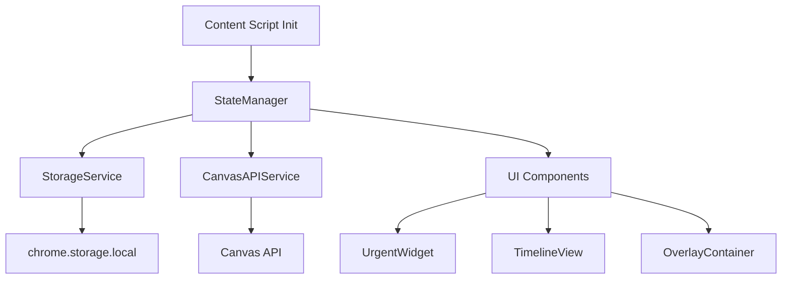
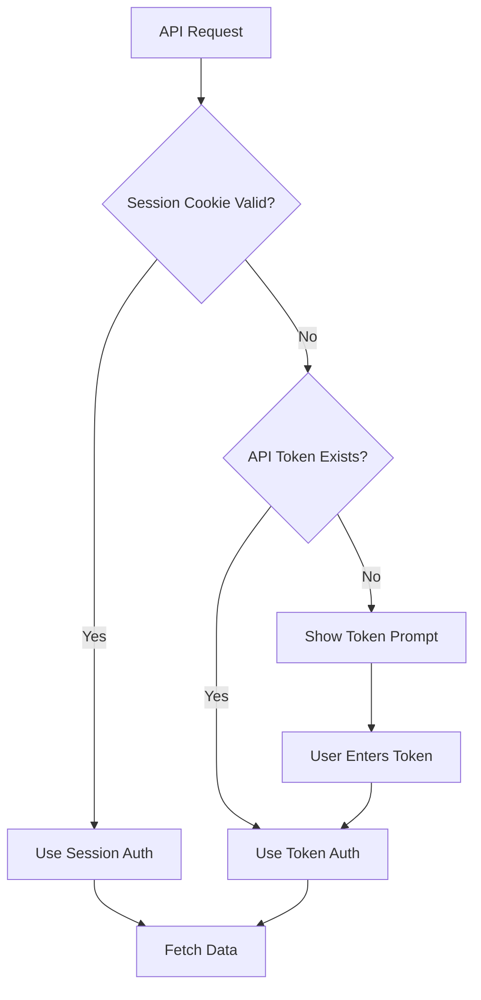

## Technical Architecture

### State Management Flow


### Authentication Flow



### Data Filtering Logic

**Most Urgent (48-hour filter):**
```javascript
const urgentItems = plannableItems.filter(item => {
  const dueDate = new Date(item.plannable.due_at);
  const hoursUntilDue = (dueDate - now) / (1000 * 60 * 60);
  return hoursUntilDue >= 0 && hoursUntilDue <= 48;
});
```

**Timeline Spacing:**
- Calculate date range (earliest to latest due date)
- Distribute assignments proportionally along horizontal axis
- Use CSS `transform: translateX()` for positioning
- Min spacing: 120px between cards to prevent overlap

---


